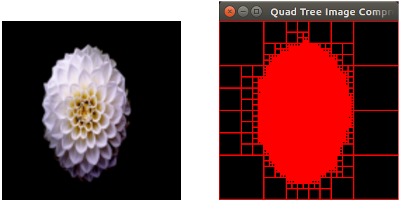

# quad-tree-image-compressor

Image compressor (*for BMP format images with specific dimensions ONLY !!!*) that uses Quad Tree to recognize similar data and compact it.



Notes:
 * the tool only works with BMP files,
 * the image width and height must be identical,
 * the image dimensions (width and height) must be equal to one of the following values:
(8, 16, 32, 64, 128, 256, 512)

## Install and compile the Quad Tree C library

The Quad Tree structure is implemented into an external project `c-data-structures`.

```sh
git submodule init
git submodule update
```

Compile the libraries:

```sh
mkdir c-data-structures/build && cd c-data-structures/build
cmake ..
make
```

## Build the development environment

```sh
vagrant up
```

## Connect to the development environment

```sh
vagrant ssh
```

## Compilation

```sh
cargo build --release
```

## Usage

```sh
./target/release/quad-tree-image-compressor image.bmp
```
